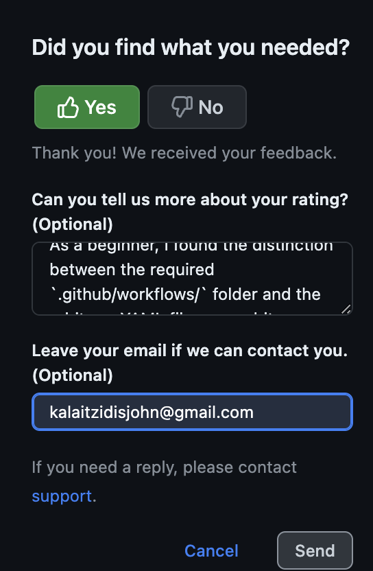

# github-actions-quickstart

This repository is part of CIS 3500 HW2. It demonstrates the basics of GitHub Actions for continuous integration and workflow automation.

- **Author:** Ioannis (Yannis) Kalaitzidis
- **Course:** CIS 3500 @ University of Pennsylvania  
- **Created:** February 2025

## Documentation Feedback

I submitted feedback on the GitHub Actions Quickstart page to clarify the required `.github/workflows/` folder name versus the flexibility of the YAML file name. This distinction is important for beginners unfamiliar with GitHub Actions' expectations.

